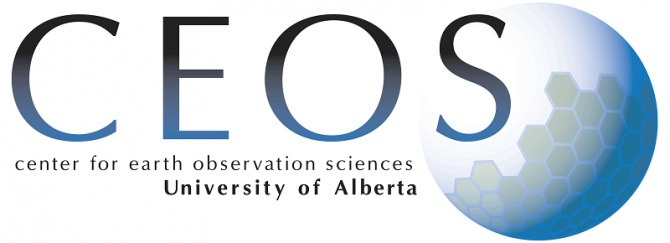

<!-- README.md is generated from README.Rmd. Please edit that file -->

```{r, include = FALSE}
knitr::opts_chunk$set(
  collapse = TRUE,
  comment = "#>"
)
```

# Center for Earth and Observation Sciences documentation

This is the repository where we keep the documentation related to processes for
research in the lab.

To check the documentation, please visit this [site](https://ceos-university-of-alberta.github.io/ceos_tutorials/)

## Getting help

If you need help with the documentation or you find an error please create an
issue [here](https://github.com/CEOS-University-of-Alberta/ceos_tutorials/issues)

## Contributing guide

If you want to contribute to the documentation, please 



