## Objective

This is a step by step guide on how to process the raw data from the
Santa Rosa National Park Environmental Super Site in Guanacaste, Costa
Rica.

### Software

-   Loggernet
-   EddyPro

## From `.DAT` to `TOB1` files

-   Files from the Santa Rosa tower comes from a Campbell Scientific
    logger that needs to be transformed in order to be processed by the
    EddyPro software (LICOR)
-   Identify your folder with the `.DAT` files to be converted
-   Open the program LoggerNet.
-   Select Data &gt; Card convert &gt; Select card drive

### Folder with `.DAT` files

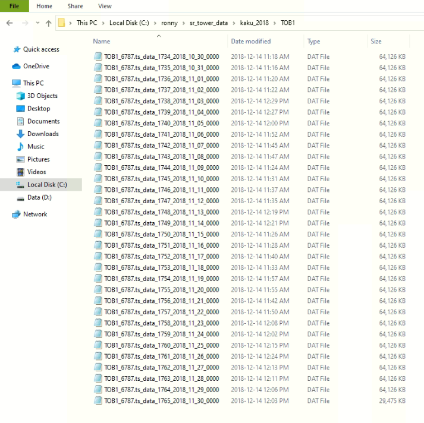

### LoggerNet CardConvert

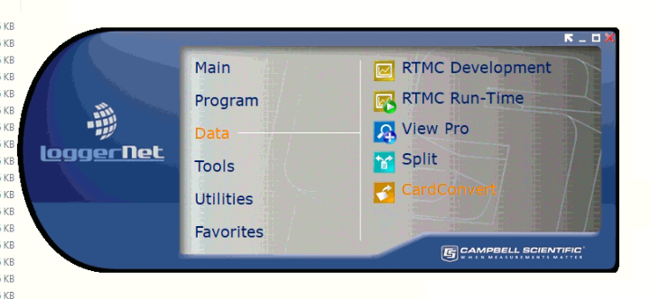

### Select input folder

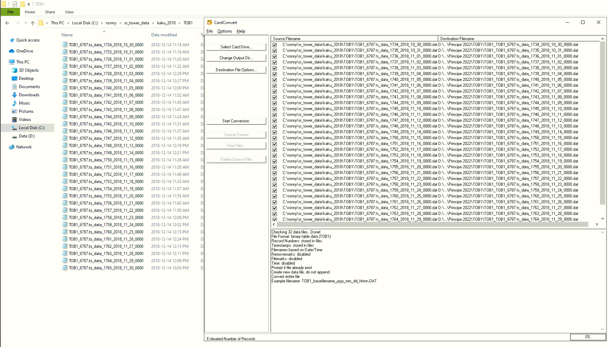

### Select output folder

This is the folder where we want all our processed files to be stored.

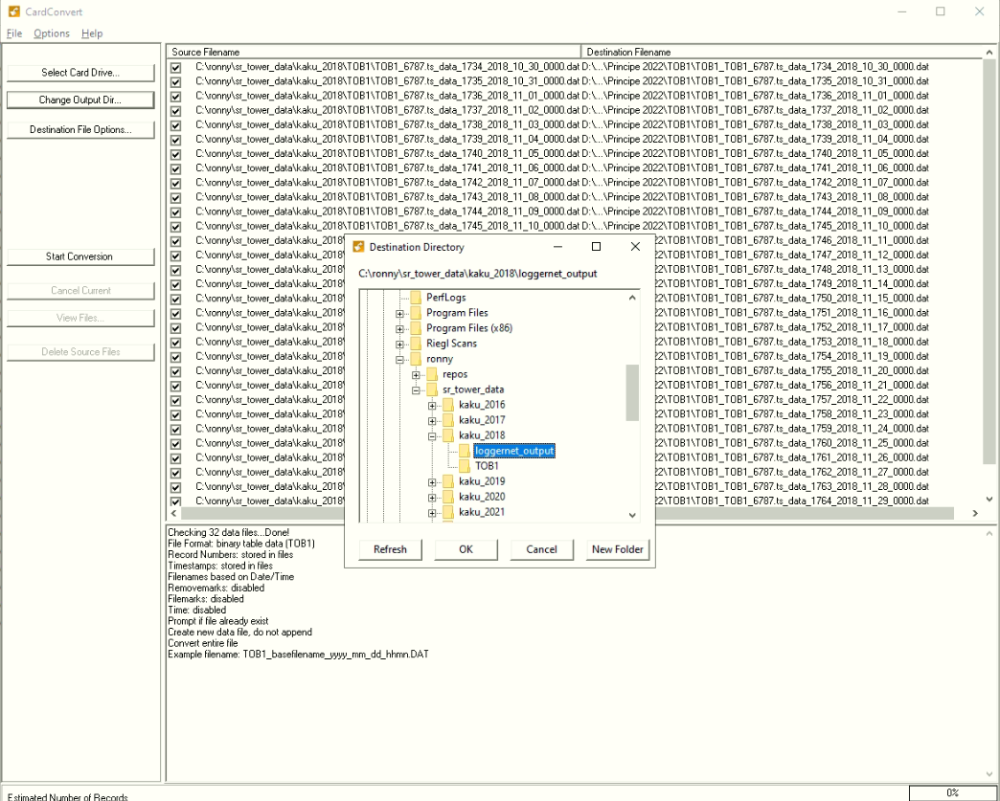

### Destination file options

Make sure to select **TOB1**

### Conversion process

If there is an error in one of the files, all the process will stop and
we will have to start over.

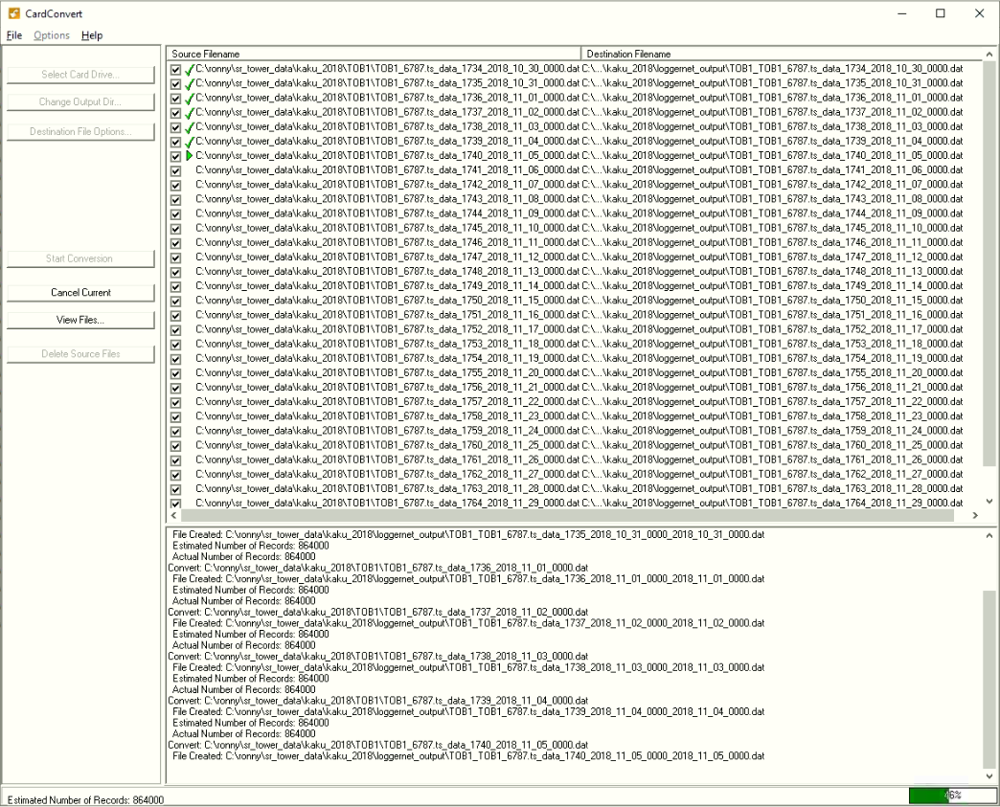

## From `TOB1` to `csv` files

Now, we are going to use the EddyPro software.

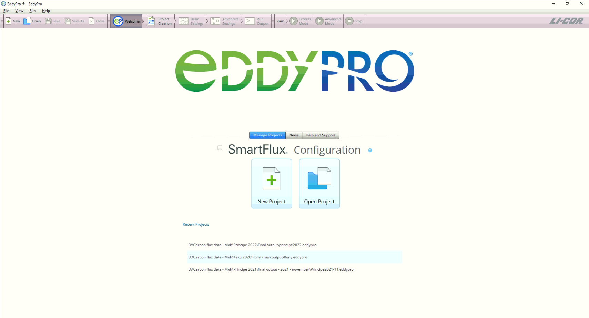

### Create new project:

First, we have to create a project and select the raw file format as
`.TOB1`. Also we need to add a meta data file which is:

-   `Metadata_EddyPro_v1_2.metadata`

If you don’t have this file, please ask for this to the lab manager.

**Select input folder** 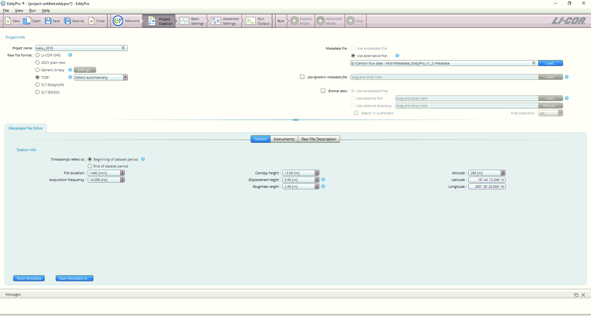

### File names patterns

Files processed from the LoggerNet will have a pattern in their name. We
need to follow this rules in order to not have any problem with the
conversion process in the eddy pro software.

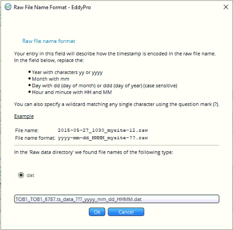

### Basic settings

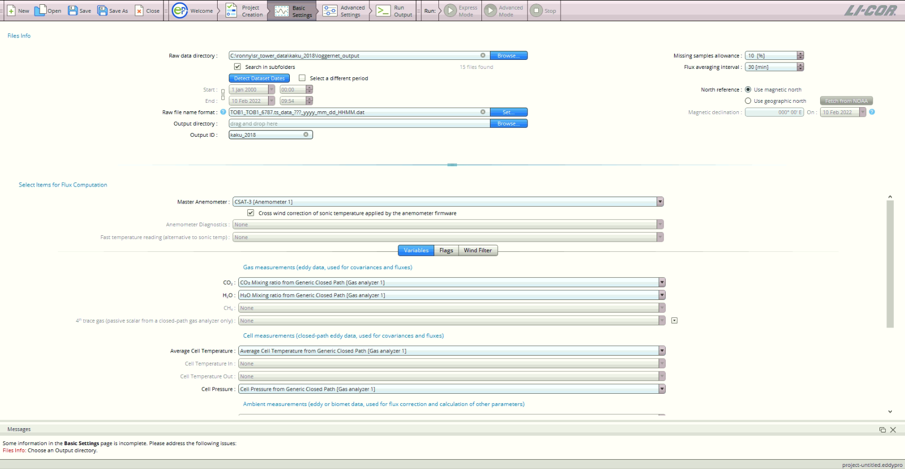

### Advance settings processing options

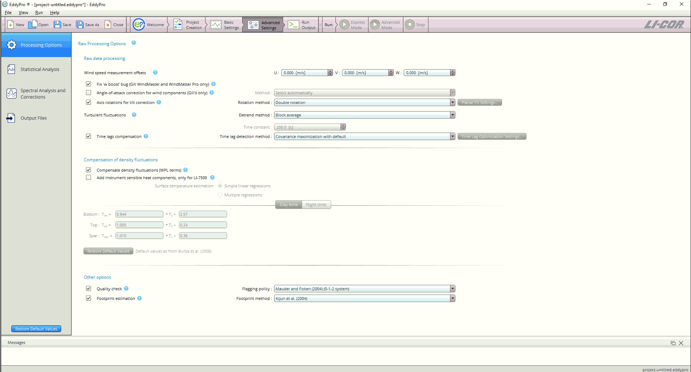

### Advance settings statistical analysis

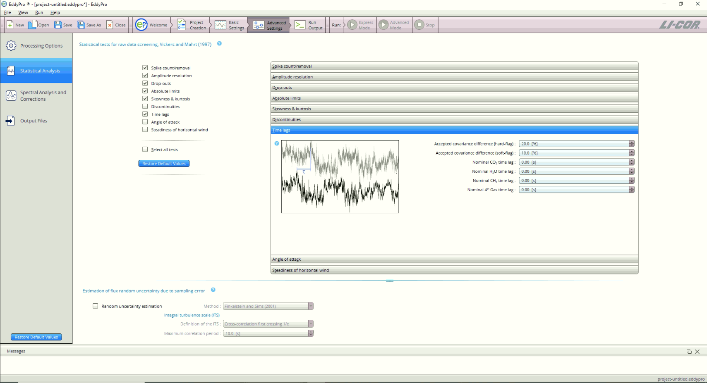

### Advance settings spectral analysis and corrections

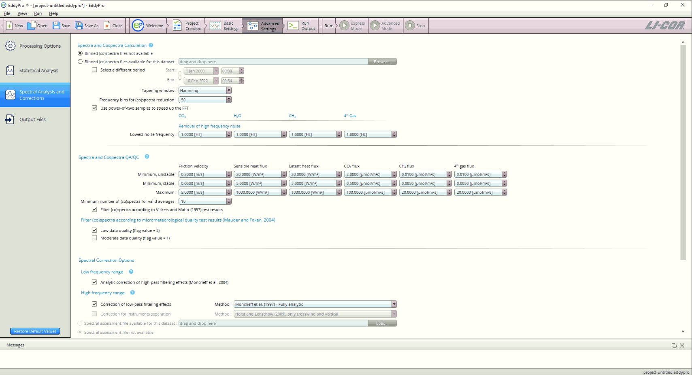

### Advance settings output files

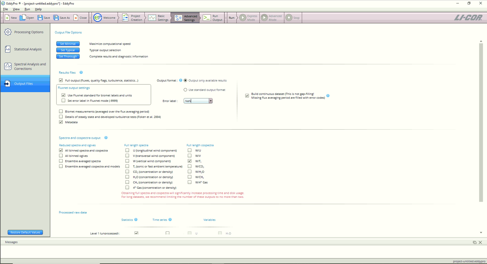

### Run the process

Up to this point, we have been working just in the settings to process
the data. Nothing have been done with the data. Given that we configure
the advance options we are going to run the process in the **Advance
mode**

If you didn’t set up something correctly, you will have an error message
indicating were was the error, so you can fixed it.

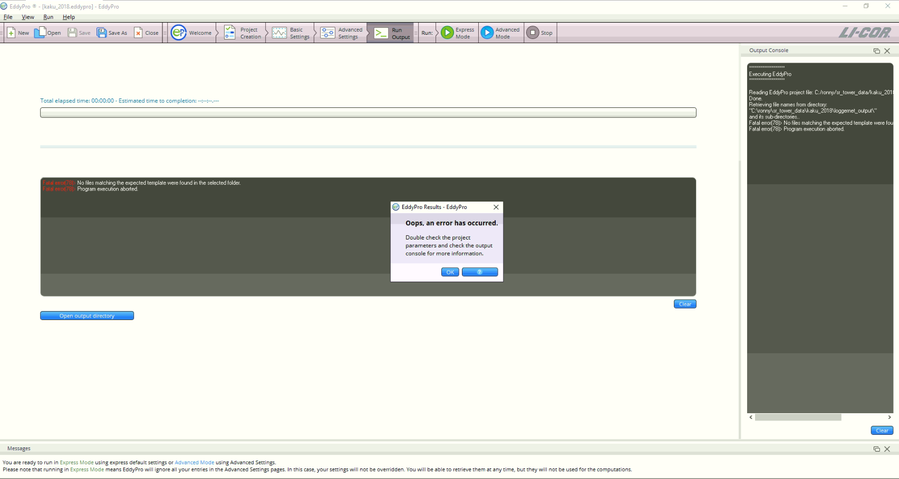

After fixing the error, you can start the process again and it will look
like this:

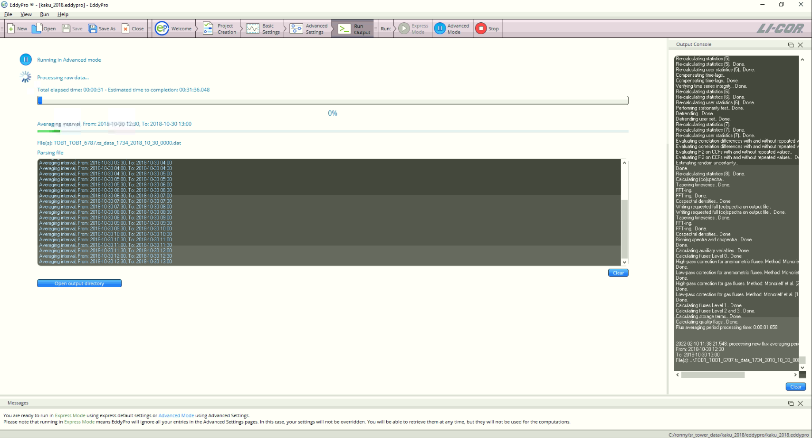
