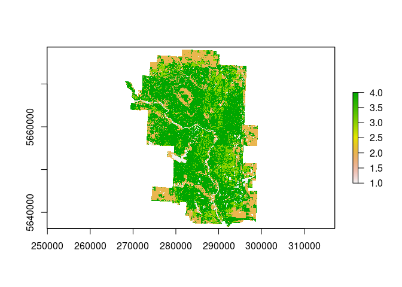
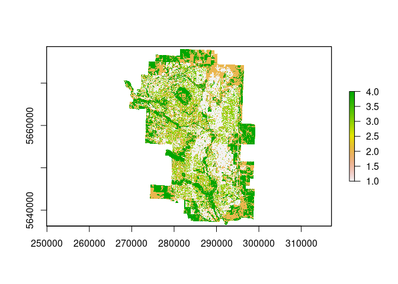
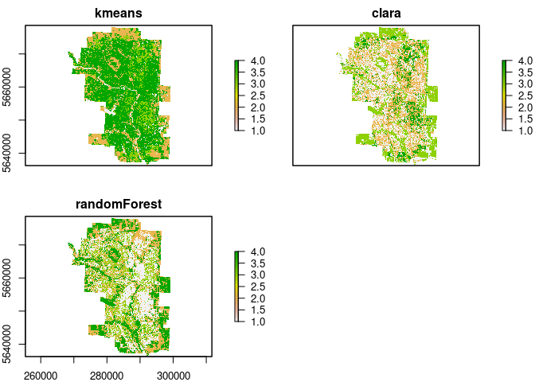

# Multispectral image classification

This is the documentation for the multispectral image classification
tutorial. All the steps, code and explan

-   Connor Bax & [Ronny A. Hernández Mora](http://ronnyhdez.rbind.io/)
-   23/11/2021

If you want to follow this tutorial you can download all the code from:

-   <https://github.com/CEOS-University-of-Alberta/multispectral_image_classification>

After you download all the materials, unzip your folder and open your
.Rproj file.

# Prepare your working folder

If you downloaded this repo directly from GitHub, make sure to create a
`data` folder in your repository. Put all the downloaded files there in
order to run all the code below.

You can set up your `data` folder with this code:

    fs::dir_create(path = paste0(here::here(), "/data"))

# R packages needed for the analysis

    library(RStoolbox)
    library(raster)
    library(RStoolbox) 
    library(raster)
    library(tidyverse)
    library(sf)
    library(rpart)
    library(rpart.plot)
    library(rasterVis)
    library(mapedit)
    library(mapview)
    library(caret)
    library(forcats)
    library(patchwork)
    library(cluster)
    library(randomForest)

# Understanding the image data

We are going to read the raster image which is in a `.tiff` extention.
This image comes from Landsat 8. Bands are as follows:

-   Band 1 Coastal aersol
-   Band 2 Blue
-   Band 3 Green
-   Band 4 Red
-   Band 5 Near Infrared (NIR)
-   Band 6 Shortwave Infrared (SWIR) 1
-   Band 7 Shortwave Infrared (SWIR) 2
-   Band 8 Panchromatic
-   Band 9 Cirrus
-   Band 10 Thermal Infrared (TIRS) 1
-   Band 11 Thermal Infrared (TIRS) 2

We are going to read individually each of the bands as follows:

    band1 <- raster("data/band1.tif")
    band2 <- raster("data/band2.tif")
    band3 <- raster("data/band3.tif")
    band4 <- raster("data/band4.tif")
    band5 <- raster("data/band5.tif")
    band6 <- raster("data/band6.tif")
    band7 <- raster("data/band7.tif")
    band8 <- raster("data/band8.tif")
    band9 <- raster("data/band9.tif")
    band10 <- raster("data/band10.tif")
    band11 <- raster("data/band11.tif")

## Exploring and preparing the data

Let’s take a look at some of the bands. Notice any variation or bands
that stand out

    plot(band1)

    plot(band10)

    plot(band5)

Now, let’s take a look of the band resolutions:

    bands <- c(band1, band2, band3, band4, band5, band6, 
               band7, band8, band9, band10, band11)

    for (i in bands) {
      check <- res(i)
      print(check)
    }

    ## [1] 30 30
    ## [1] 30 30
    ## [1] 30 30
    ## [1] 30 30
    ## [1] 30 30
    ## [1] 30 30
    ## [1] 30 30
    ## [1] 15 15
    ## [1] 30 30
    ## [1] 30 30
    ## [1] 30 30

### Stacking the images

In order to stack all the images together, we must ensure that all the
resolutions match. To achieve this, we are going to use the function
`aggregate` to lower the resolution (larger number) of the image with
the higher resolution (lower number).

Using `fact = 2` means that we are multiplying the current resolution by
2. If we wanted to divide it by 2 we can use 1/2, or 0.5

    band8 <- aggregate(band8, fact = 2)

Now that we have all the images with the same resolution, we are going
to procced to stack the bands into one image:

    image <- stack(band1, band2, band3, band4, band5, band6, 
                   band7, band8, band9, band10, band11)

How do we make sure that this step worked? Well, we just add 11 bands
into one image, so this should have 11 layers. The function below should
return 11.

    nlayers(image) 

    ## [1] 11

### Spatial reference

Now we are going to check that our resulting image have a spatial
reference that its still valid. Otherwise our image will be lost
spatially. We can check this with the following code:

    crs(image)

    ## Coordinate Reference System:
    ## Deprecated Proj.4 representation:
    ##  +proj=utm +zone=12 +datum=WGS84 +units=m +no_defs 
    ## WKT2 2019 representation:
    ## PROJCRS["WGS_1984_UTM_Zone_12N",
    ##     BASEGEOGCRS["WGS 84",
    ##         DATUM["World Geodetic System 1984",
    ##             ELLIPSOID["WGS 84",6378137,298.257223563,
    ##                 LENGTHUNIT["metre",1]]],
    ##         PRIMEM["Greenwich",0,
    ##             ANGLEUNIT["degree",0.0174532925199433]],
    ##         ID["EPSG",4326]],
    ##     CONVERSION["Transverse Mercator",
    ##         METHOD["Transverse Mercator",
    ##             ID["EPSG",9807]],
    ##         PARAMETER["Latitude of natural origin",0,
    ##             ANGLEUNIT["degree",0.0174532925199433],
    ##             ID["EPSG",8801]],
    ##         PARAMETER["Longitude of natural origin",-111,
    ##             ANGLEUNIT["degree",0.0174532925199433],
    ##             ID["EPSG",8802]],
    ##         PARAMETER["Scale factor at natural origin",0.9996,
    ##             SCALEUNIT["unity",1],
    ##             ID["EPSG",8805]],
    ##         PARAMETER["False easting",500000,
    ##             LENGTHUNIT["metre",1],
    ##             ID["EPSG",8806]],
    ##         PARAMETER["False northing",0,
    ##             LENGTHUNIT["metre",1],
    ##             ID["EPSG",8807]]],
    ##     CS[Cartesian,2],
    ##         AXIS["easting",east,
    ##             ORDER[1],
    ##             LENGTHUNIT["metre",1]],
    ##         AXIS["northing",north,
    ##             ORDER[2],
    ##             LENGTHUNIT["metre",1]],
    ##     ID["EPSG",32612]]

-   What coordinate system is used?
-   Often the ‘zone’ is accompanied by either an S or N, what would
    these indicate?

Now, we also want to confirm the resolution of the image matches the
aggregated resolution

    res(image)

    ## [1] 30 30

## Plotting our image

Finally we have confirmed the necessary information of our created
image. Let’s try to plot it using some band combinations. We will try:

-   True Color Composite
-   False Color Composite

### True Color Composite

    par(col.axis = "white", col.lab = "white", tck = 0)
    plotRGB(image, r = 4, g = 3, b = 2, axes = TRUE, 
            stretch = "lin", main = "True Color Composite")
    box(col = "white")

-   What bands are used in the True Color Composite? (Refer to the band
    list at the top ex: Band 9 (Cirrus))

### False Color Composite

    par(col.axis = "white", col.lab = "white", tck = 0)
    plotRGB(image, r = 5, g = 4, b = 3, axes = TRUE, stretch = "lin",
            main = "False Color Composite")
    box(col = "white")

-   What bands are used in the True Color Composite? (Refer to the band
    list at the top ex: Band 9 (Cirrus))
-   What appears to be the main feature of the False Color Composite?
    (In RED)

### Cleaning our working environment

We are done with our image, but to start we created some objects that we
no longer need, given that from now on, all our work is going to be
based on the `image` object.

All the `bands` object that we created before can be remove from our
`Global environment`. This will allow us to free some temporal memory
space.

    # Remove all the bands (11 in total)
    for (i in 1:11) {
      rm(list = paste0("band", i))
    }

    # Remove our `bands` vector
    rm(bands)

Also, we can use a general ‘garbage collection’ to free up some space as
well that may be occupied

    gc()

    ##            used  (Mb) gc trigger  (Mb) max used  (Mb)
    ## Ncells  5722153 305.6   10480042 559.7  9705519 518.4
    ## Vcells 15389940 117.5   38827878 296.3 75489854 576.0

## Calculating NDVI index

-   By observing our composites images we can see a large amount of
    vegetation.
-   Given our available bands, we can derive an NDVI (Normalized
    Difference Vegetation Index)
-   Recall that NDVI scales from -1 to +1, with +1 indicating more
    vegetation cover
-   These values are largely driven by pigments in vegetation measured
    by the bands used

We can calculate our NDVI index as follows:

    ndvi <- (image[[5]] - image[[4]]) / (image[[5]] + image[[4]])

-   What bands are used in the NDVI calculation?
-   Why these bands? (Recall the Vegetation Spectrum)

### Exploring the NDVI result

Now, with the help of some functins, we can explore what is the
resulting NDVI values for our image:

    # minimum
    min(ndvi@data@values, na.rm = T)

    ## [1] -0.1987892

    # maximum
    max(ndvi@data@values, na.rm = T)

    ## [1] 0.6099971

    # standard deviation
    sd(ndvi@data@values, na.rm = T)

    ## [1] 0.1311813

    # summary
    summary(ndvi)

    ##                 layer
    ## Min.    -1.987892e-01
    ## 1st Qu.  1.509053e-01
    ## Median   2.238097e-01
    ## 3rd Qu.  3.335210e-01
    ## Max.     6.099971e-01
    ## NA's     6.410260e+05

    summary(ndvi@data@values)

    ##    Min. 1st Qu.  Median    Mean 3rd Qu.    Max.    NA's 
    ##    -0.2     0.2     0.2     0.2     0.3     0.6  641026

### Plotting NDVI index

Also, other way to explore our resulting NDVI index, we can plot it:

    as(ndvi, "SpatialPixelsDataFrame") %>% 
      as.data.frame() %>%
      ggplot(data = .) +
      geom_tile(aes(x = x, y = y, fill = layer)) +
      theme(axis.text = element_blank(),
            axis.ticks = element_blank(),
            panel.background = element_blank(),
            panel.grid.minor = element_blank()) +
      labs(title = "NDVI for Calgary, Alberta", 
           x = " ", 
           y = " ") +
      scale_fill_gradient(high = "#CEE50E", 
                          low = "#087F28",
                          name = "NDVI")

-   Feel free to use other color gradients and plotting schemes, be as
    creative as you wish
-   Do the higher NDVI values match up with any thing from the True
    Color or False Color Composites?

## Supervised Classification

We are now going to attempt a Supervised Classification to try and
classify each pixel of the image into various classes. Because this is a
Supervised Classification we will first need to create a training
dataset as a first step.

This is an interactive process, meaning that everytime that we run the
code `editMap()` an interface will open on the **Viewer panel**. This
interface will allow us to click and point the image to generate some
object in our Global Environment.

### Details

TODO: This is not anymore polygons, we are going to use points.

The below line will open up RGB image in the plotting window as an
interactive image. You can pan around with the hand and zoom in with the
scroll wheel. Get familiar with the controls and movement before moving
on. Once comfortable, select the option from the left menu for drawing a
‘polygon’, this will allow you to click and define a polygon You are
clicking to place the vertices, so be aware that it will be drawing
straight lines between points. Once you have defined a polygon click on
the first point to close it, then you can click ‘cancel’ to clear the
tool and move to the next area. Please only do one class at a time,
meaning that **if you are defining agriculture, just draw all**
**agriculture polygons**.

Once you have draw several polygons for one class, select ‘done’ in the
bottom right.

We will repeat this process for each of the following classes:

-   Urban
-   Water
-   Agriculture
-   Other Vegetation

Be aware that it may be beneficial to use the False Color Composite for
some classes such as water.

Other vegetation will cover things such as shrublands, forests, or
grasslands that are possible not as vibrant green as agriculture

Also, this step can crash some R sessions in computers with limited
memory. So, after each polygon is created, we are using the function
`saveRDS`, that is going to save the object in our `data` folder.

Say for example that you spend 15 minutes creating the agriculture
polygons. Now you are working on creating the urban polygons but in the
middle of that process your R session just crashed.

You can load the agriculture polygons and avoid start over again with
this category. The code to load the saved polygons objects is below.

#### Agriculture

    # Create polygons
    points_agriculture <- viewRGB(image, r = 4, g = 3, b = 2) %>% 
      editMap()

    # Save object
    saveRDS(points_agriculture, file = "data/points_agriculture.rds")

    # Rename column with agriculture geometries
    agriculture <- points_agriculture$finished$geometry %>% 
      st_sf() %>% 
      mutate(class = "agriculture", id = 1)

#### Urban

    # Create polygons
    points_urban <- viewRGB(image, r = 4, g = 3, b = 2) %>% 
      editMap()

    # Save object
    saveRDS(points_urban, file = "data/points_urban.rds")

    # Rename column with urban geometries
    urban <- points_urban$finished$geometry %>% 
      st_sf() %>% 
      mutate(class = "urban", id = 2)

#### Water

    # Create polygons
    points_water <- viewRGB(image, r = 5, g = 4, b = 3) %>% 
      editMap()

    # Save object
    saveRDS(points_water, file = "data/points_water.rds")

    # Rename column with water geometries
    water <- points_water$finished$geometry %>% 
      st_sf() %>%
      mutate(class = "water", id = 3)

#### Vegetation

    # Create polygons
    points_vegetation <- viewRGB(image, r = 4, g = 3, b = 2) %>% 
      editMap()

    # Save object
    saveRDS(points_vegetation, file = "data/points_vegetation.rds")

    # Rename column with vegetation geometries
    veg <- points_vegetation$finished$geometry %>% 
      st_sf() %>%
      mutate(class = "vegetation", id = 4)

### Loading points files

If you missed one of your processes, load the point file with the next
instruction. Just use the one that you need:

    agriculture <- readRDS(file = "data/points_agriculture.rds")
    veg <- readRDS(file = "data/points_urban.rds")
    water <- readRDS(file = "data/points_water.rds")
    urban <- readRDS(file = "data/points_vegetation.rds")

### Collect al training data

Now that we have all the polygons, we need to collect all this
information into one object that we call **training dataset**

    training_points <- rbind(agriculture, veg, water, urban) %>% 
      as.data.frame()

At this point, this is just an object in `Global environment` To export
this and use it in other projects or in a R session later (instead of
repeating again all the steps before), we can save it as a shapefile.

Be aware that we are saving this in our `data` folder within our working
project.

    write_sf(training_points, 
             "data/calgary_training_points.shp",
             driver = "ESRI shapefile")

If we want to read this in a later R session, we can do it as follows:

    training_points <- st_read("data/calgary_training_points.shp")

    ## Reading layer `calgary_training_points' from data source 
    ##   `/home/ronny/Documents/repos/github/ceos/ceos_tutorials/data/calgary_training_points.shp' 
    ##   using driver `ESRI Shapefile'
    ## Simple feature collection with 91 features and 2 fields
    ## Geometry type: POINT
    ## Dimension:     XY
    ## Bounding box:  xmin: -114.2097 ymin: 50.86595 xmax: -113.8678 ymax: 51.13811
    ## Geodetic CRS:  WGS 84

#### Explore training dataset

Now, we are going to check the distribution of points for our training
dataset. At first, we are going to read the Calgary city boudary:

    city_boundary <- st_read("data/CityBoundary.geojson", quiet = TRUE)

Now, we are going to create a map looking at just the distribution of
points:

    points_distribution <- ggplot() +
      geom_sf(data = city_boundary, fill = "light gray", color = NA) +
      geom_sf(data = training_points, size = 0.5) +
      labs(title = "Distribution of\nclassification points") +
      theme(panel.background = element_blank(), axis.ticks = element_blank(), 
            axis.text = element_blank())

    points_distribution

Great! We are going to create a second map looking at the distribution
of points by the classification type that we created:

    points_categories <- ggplot() +
      geom_sf(data = city_boundary, fill = "light gray", color = NA) +
      geom_sf(data = training_points, aes(color = class), size = 0.5) +
      scale_color_viridis_d() +
      labs(title = "Classification points by land use") +
      theme(panel.background = element_blank(), axis.ticks = element_blank(), 
            axis.text = element_blank())

    points_categories

Now, we are going to put both plots side by side:

    points_distribution + 
      points_categories + 
      plot_layout(ncol = 2)

See how your distribution is allocated, if you feel as though it is
biased to one section or not well distributed you may wish to redo the
training data specification.

#### Extracting spectral data for training points

Now we will extract the spectral data or band data for our training
points. First convert to a spatial point format

    training_points <- as(training_points, 'Spatial')

Now we have a new object with the bands information, but it’s in a a
special structure called `SpatialPointsDataFrame`. Our next step will be
to extract the values in this object and the image (trainign data
points) in a matrix structure:

    training_values_matrix <- raster::extract(image, training_points) %>%
      round()

    ## Warning in .local(x, y, ...): Transforming SpatialPoints to the
    ## crs of the Raster

Now, we should have a matrix of band values for each point

    head(training_values_matrix)

    ##      band1 band2 band3 band4 band5 band6 band7 band8 band9
    ## [1,]  9530  8610  7926  6932 18751  9616  6885  7577  5070
    ## [2,]  9535  8602  8141  6850 23999  9585  6947  7578  5065
    ## [3,]  9842  9211 10517  9432 26344 11032  7860  9947  5065
    ## [4,]  9626  8811  8410  7594 17444 12394  8562  8039  5055
    ## [5,]  9668  9063 10535  9434 27810 10496  7499  9956  5069
    ## [6,]  9786  9195 10887  9815 28364 11230  7973 10334  5087
    ##      band10 band11
    ## [1,]  26574  24651
    ## [2,]  26404  24508
    ## [3,]  26641  24780
    ## [4,]  28911  26357
    ## [5,]  25827  24022
    ## [6,]  26447  24546

-   Try exploring the data through plotting
-   Remember you id numbers from the sections above

<!-- -->

    profiles <- training_values_matrix %>% 
      as.data.frame() %>% 
      cbind(., training_points$id) %>% 
      rename(id = "training_points$id") %>% 
      na.omit() %>% 
      group_by(id) %>% 
      summarise(band1 = mean(band1),
                band2 = mean(band2),
                band3 = mean(band3),
                band4 = mean(band4),
                band5 = mean(band5),
                band6 = mean(band6),
                band7 = mean(band7),
                band8 = mean(band8),
                band9 = mean(band9),
                band10 = mean(band10),
                band11 = mean(band11)) %>% 
      mutate(id = case_when(id == 1 ~ "agriculture",
                            id == 2 ~ "urban",
                            id == 3 ~ "water",
                            id == 4 ~ "other vegetation"
      )) %>% 
      as.data.frame()

    # Take a look of the first values
    glimpse(profiles)

    ## Rows: 4
    ## Columns: 12
    ## $ id     <chr> "agriculture", "urban", "water", "other vegetati…
    ## $ band1  <dbl> 9885.654, 11275.897, 9662.667, 9995.286
    ## $ band2  <dbl> 9158.038, 10688.795, 8742.917, 9274.214
    ## $ band3  <dbl> 9662.769, 10306.103, 7821.667, 9009.643
    ## $ band4  <dbl> 8673.038, 10425.872, 6791.417, 8467.929
    ## $ band5  <dbl> 23836.077, 14951.462, 6587.833, 18410.286
    ## $ band6  <dbl> 11477.308, 13372.897, 5450.083, 14023.786
    ## $ band7  <dbl> 8322.731, 11576.154, 5276.417, 9731.429
    ## $ band8  <dbl> 9166.500, 10354.333, 7408.583, 8752.643
    ## $ band9  <dbl> 5069.500, 5079.410, 5045.000, 5103.857
    ## $ band10 <dbl> 26881.77, 30648.46, 25931.75, 29389.14
    ## $ band11 <dbl> 24886.50, 27825.49, 24022.00, 26764.50

After all this data wrangling, we have a data frame with our values of
interest that can be used to create a plot of the profiles, to check if
they are indeed unique and distinguishable

    profiles %>% 
      select(-id) %>% 
      gather() %>% 
      mutate(class = rep(c("agriculture", "urban", "water", "other vegetation"),
                         11)) %>% 
      ggplot(data = ., aes(x = fct_relevel(as.factor(key),
                                           levels = c("band1", "band2", 
                                                      "band3", "band4",
                                                      "band5", "band6",
                                                      "band7", "band8",
                                                      "band9", "band10",
                                                      "band11")), y = value, 
                           group  = class, color = class)) +
      geom_point(size = 2.5) +
      geom_line(lwd = 1.2) +
      scale_color_viridis_d() +
      labs(title = "Spectral Profile from Landsat 8 Imagery",
           x = "Bands",
           y = "Reflectance",
           color = "Class") +
      #scale_y_continuous(limits=c(5000, 15000)) +
      theme(axis.text.x = element_text(angle = 45, h = 1)) +
      theme(panel.background = element_blank(),
            panel.grid.major = element_line(color = "gray", size = 0.5),
            panel.grid.minor = element_line(color = "gray", size = 0.5),
            axis.ticks = element_blank())

    ## Warning: Outer names are only allowed for unnamed scalar atomic
    ## inputs

    ## Warning: Outer names are only allowed for unnamed scalar atomic
    ## inputs

    ## Warning: Outer names are only allowed for unnamed scalar atomic
    ## inputs

Another way to assess this is through a density plot, note any severe
overlap between classes at each band. The mean values will also indicate
if there is a large degree of overlap between classes:

    profiles %>% 
      select(-id) %>% 
      gather() %>% 
      mutate(class = rep(c("agriculture", 
                           "urban", 
                           "water", 
                           "other vegetation"), 11)) %>% 
      ggplot(., aes(x = value,
                    group = as.factor(class),
                    fill = as.factor(class))) + 
      geom_density(alpha = 0.75) + 
      geom_vline(data = . %>% 
                   group_by(class) %>%
                   summarise(grp.mean = mean(value)),
                 aes(xintercept = grp.mean, color = class),
                 linetype = "dashed", size = 1) +
      scale_fill_manual(values = c('lawngreen',
                                   'burlywood',
                                   'lightblue',
                                   'darkgreen'),
                        name = "class") +
      scale_color_manual(values = c("black",
                                    "red",
                                    "orange",
                                    "yellow")) +
      theme(panel.background = element_blank(),
            panel.grid.major = element_line(color = "gray", size = 0.5),
            panel.grid.minor = element_line(color = "gray", size = 0.5),
            axis.ticks = element_blank()) +
      labs(x = "Reflectance Value",
           y = "Density",
           title = "Density histograms of spectral profiles",
           subtitle = "Vertical lines represent mean group reflectance values")

-   Note the similarities in overlap between the density plot and the
    spectral profile.
-   These overlapping classes may prove to be difficult to distinguish
    via the classification.

### Classifyng the image

Now we can move onto classifying the image by training the model. As a
first step, we are going to combine the classes and extracted point
values in one data frame:

    training_set <- data.frame(training_points$class, training_values_matrix)

We then use the rpart() to train the model

    model_class <- rpart(as.factor(training_points.class) ~ . ,
                         data = training_set, method = 'class')

Now, we are going to plot a decision tree resulting from the training

    rpart.plot(model_class, box.palette = 0, main = "Classification Tree")

We are set with the training section and the model creation. Now we can
run the model to obtain the predictions of the entire image:

    predictions <- predict(image, model_class, 
                           type = 'class',
                           progress = 'text') %>% 
      ratify()

    ##   |                                                               |                                                       |   0%  |                                                               |==============                                         |  25%  |                                                               |============================                           |  50%  |                                                               |=========================================              |  75%  |                                                               |=======================================================| 100%
    ## 

After we have all the predictions for the entire image, we are going to
set the levels to our selected classes:

    levels(predictions) <- levels(predictions)[[1]] %>%
      mutate(legend = c("agriculture","urban","water", "other vegetation"))

Finally, let’s check the result with a plot:

    levelplot(predictions, maxpixels = 1e6,
              col.regions = c('lawngreen', 'burlywood', 'lightblue', 'darkgreen'),
              scales = list(draw = FALSE),
              main = "Supervised Classification of Imagery")

-   Does the results seem reasonable?
-   Why or why not?
-   Where are areas or conflict?

To validate our results, we can use a confusion matrix in which we can
check the predicted values against the ground-truth points:

    test <- raster::extract(predictions, training_points) %>% 
      as.data.frame() %>% 
      rename(id = ".")

    ## Warning in .local(x, y, ...): Transforming SpatialPoints to the
    ## crs of the Raster

    test_probs <- data.frame(
      obs = as.factor(training_points$id),
      pred = as.factor(test$id)
    ) %>% 
      mutate(correct = ifelse(obs == pred, 1, 0))

    confMatrix <- confusionMatrix(test_probs$obs, test_probs$pred)

    confMatrix

    ## Confusion Matrix and Statistics
    ## 
    ##           Reference
    ## Prediction  1  2  3  4
    ##          1 24  0  2  0
    ##          2  0 37  2  0
    ##          3  0  0  0 12
    ##          4  0  0 14  0
    ## 
    ## Overall Statistics
    ##                                           
    ##                Accuracy : 0.6703          
    ##                  95% CI : (0.5639, 0.7653)
    ##     No Information Rate : 0.4066          
    ##     P-Value [Acc > NIR] : 3.399e-07       
    ##                                           
    ##                   Kappa : 0.5317          
    ##                                           
    ##  Mcnemar's Test P-Value : NA              
    ## 
    ## Statistics by Class:
    ## 
    ##                      Class: 1 Class: 2 Class: 3 Class: 4
    ## Sensitivity            1.0000   1.0000   0.0000   0.0000
    ## Specificity            0.9701   0.9630   0.8356   0.8228
    ## Pos Pred Value         0.9231   0.9487   0.0000   0.0000
    ## Neg Pred Value         1.0000   1.0000   0.7722   0.8442
    ## Prevalence             0.2637   0.4066   0.1978   0.1319
    ## Detection Rate         0.2637   0.4066   0.0000   0.0000
    ## Detection Prevalence   0.2857   0.4286   0.1319   0.1538
    ## Balanced Accuracy      0.9851   0.9815   0.4178   0.4114

-   Review the results, what class or classes tend to be misrepresented
    or misclassified?
-   The rows and columns of the confusion matrix should provide this
    information, as well as the sensitivity analysis
-   What is your overall accuracy?

> If you need help with the interpretation of the confusion matrix, you
> can check this
> [information](https://www.journaldev.com/46732/confusion-matrix-in-r)

## Unsupervised Image Classification

**This below section for the EAS451 class of Fall 2021 is optional**

For this section we are going to be completely hands off in the
classification process. The idea is that the classification method will
find statistically distinct pixels or clusters of pixels and use those
to define numbered classes, this will be refined multiple times to give
the fewest number of distinct classes as possible.

We will use 3 different methods:

-   Kmeans
-   Clara Clustering
-   Random Forest

Before we start, we need the original image data that we created above
with the bands.

From this image, we will create a matrix of values for the
classification:

    v <- getValues(image)
    i <- which(!is.na(v))
    v <- na.omit(v) #remove NA values because they cannot be classified

### Kmeans classification

For this classification method, we will use the `kmeans` package. The
information of this package can be found
[here](https://www.rdocumentation.org/packages/stats/versions/3.6.2/topics/kmeans)

In the `kmeans()` function we are specificying 10 initial centers of
clusters, runninig 100 iterations and 10 intiial configurations. Then,
we plot the results

    clusters <- kmeans(v, 4, iter.max = 100, nstart = 10)

    ## Warning: Quick-TRANSfer stage steps exceeded maximum (= 47147350)

    ## Warning: Quick-TRANSfer stage steps exceeded maximum (= 47147350)

    ## Warning: Quick-TRANSfer stage steps exceeded maximum (= 47147350)

    ## Warning: Quick-TRANSfer stage steps exceeded maximum (= 47147350)

    ## Warning: Quick-TRANSfer stage steps exceeded maximum (= 47147350)

    kmeans_raster <- raster(image)

    kmeans_raster[i] <- clusters$cluster

    plot(kmeans_raster)

### Clara classification

For this classification method, we will use the `clara` package. The
information of this package can be found
[here](https://www.rdocumentation.org/packages/cluster/versions/2.1.2/topics/clara)

    clus <- clara(v, 4, samples = 500, metric = "manhattan", pamLike = T)

    clara_raster <- raster(image)

    clara_raster[i] <- clus$clustering

    plot(clara_raster, col = topo.colors(5)) #try other colors as well

### Unsupervised Random Forest classification using kmeans

For this classification method, we will use the `randomForest` package.
The information of this package can be found
[here](https://www.rdocumentation.org/packages/randomForest/versions/4.6-14/topics/randomForest)

    vx <- v[sample(nrow(v), 500),]
    rf = randomForest(vx)
    rf_prox <- randomForest(vx, ntree = 1000, proximity = TRUE)$proximity

    random_forest_kmeans <- kmeans(rf_prox, 4, iter.max = 100, nstart = 10)

    random_forest_class <- randomForest(vx, 
                                        as.factor(random_forest_kmeans$cluster), 
                                        ntree = 500)

    random_forest_raster <- predict(image, random_forest_class)

    plot(random_forest_raster)

### Plotting all models results

Finally, we can plot all the three models results into one layerstack to
compare the results:

    class_stack <- stack(kmeans_raster, clara_raster, random_forest_raster)

    names(class_stack) <- c("kmeans", "clara", "randomForest")

    par(mfrow = c(3, 1))

    plot(class_stack)

-   Ideally we would then test the accuracy against the ground truth
    file, however that would require the manual merging of the
    unsupervised classes and then assessing accuracy wich for the sake
    of this assignment and time boundaries is not required
